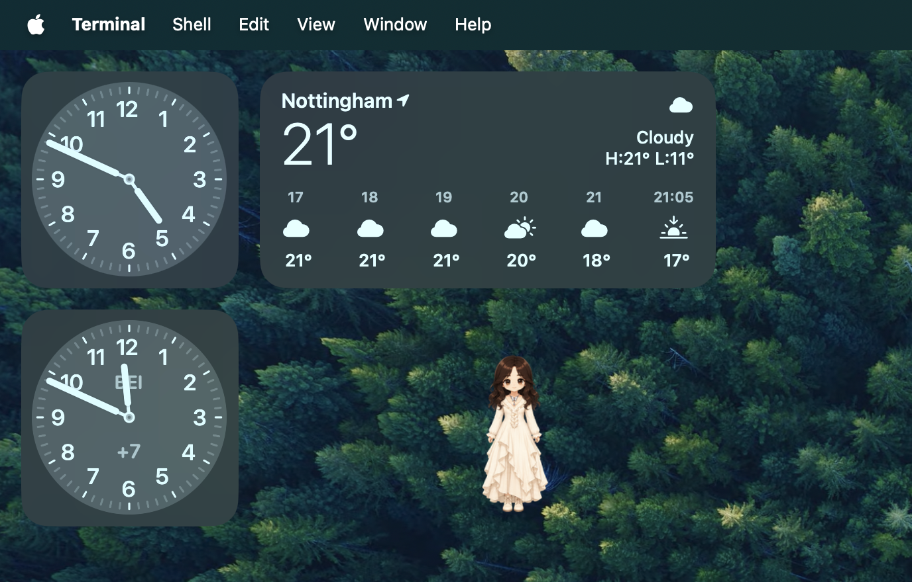
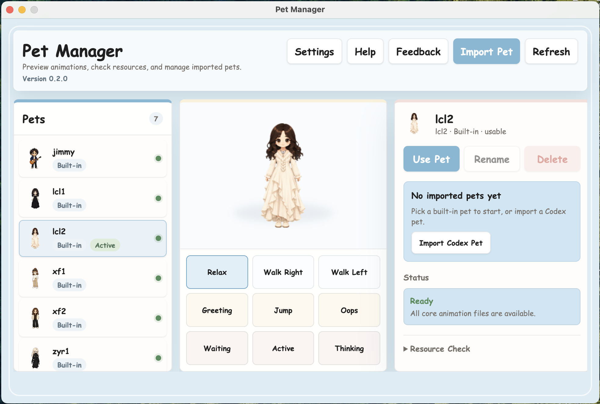

# Heng Heng Desktop Pet

A little pixel pet that lives on your desktop.



It walks around, reacts when you click or drag it, and idles on its own. There's a manager window where you can preview animations, import new pets, and change settings.



> 哼哼桌宠 — 一个住在你桌面上的像素小宠物。

macOS and Windows. Built with Electron. No network calls, everything stays on your machine.

## Quick Start

```bash
npm install
npm run start
```

## Testing

```bash
npm test              # 29 unit tests
npm run test:e2e      # Electron smoke test (write → restart → verify)
npm run check:assets  # Validate packaged assets
```

## Importing Codex Pets

Use the Import button in the Manager, or import from the CLI:

```bash
npm run import-character -- ~/.codex/pets/lcl2 --id lcl2-copy
npm run import-character -- ~/.codex/pets/lcl2/spritesheet.webp --id lcl2-copy
npm run import-character -- ~/.codex/pets/lcl2 --id lcl2-copy --force
```

Character packages use this structure:

```text
assets/characters/<character-id>/
  icon.png
  manifest.json
  frames/
    idle/
    running-right/
    running-left/
    waving/
    jumping/
    failed/
    waiting/
    running/
    review/
```

## Packaging

```bash
npm run dist                # macOS (dmg + zip)
npm run dist -- --win       # Windows (nsis + zip), works from macOS too
```

## Architecture

See [docs/ARCHITECTURE.md](docs/ARCHITECTURE.md) for diagrams.

Two renderer windows (pet + manager) talk to the main process through a single preload bridge. Main process is split into small services — window management, character loading, settings, security. No shared mutable state between services.

## Security

Renderers run with `contextIsolation: true` and a locked-down CSP (`connect-src 'none'`, no frames, no workers). The preload exposes 17 methods and nothing else — no shell, no dynamic channels. Every IPC call is validated against a known-window allowlist before it runs. Navigation, redirects, and new windows are all blocked.
