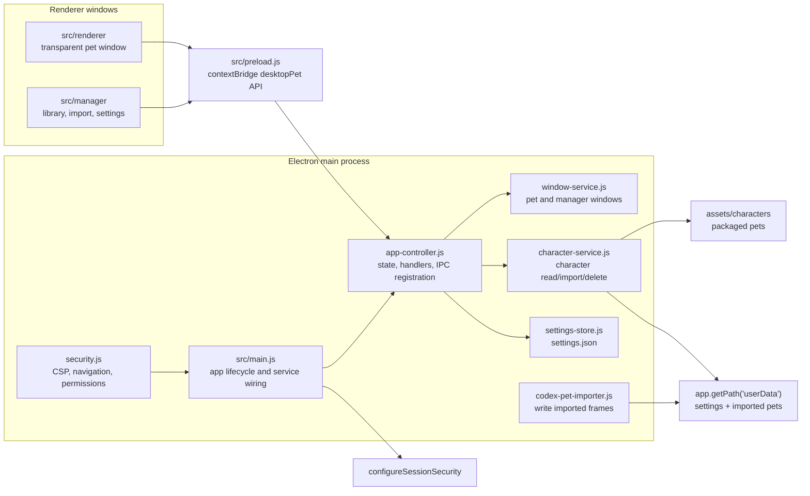
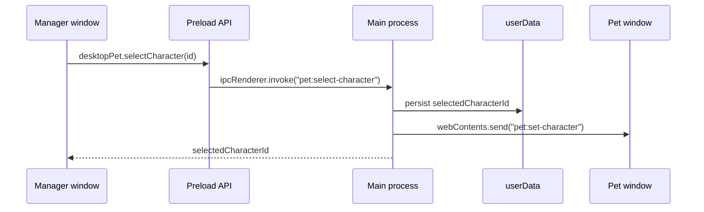
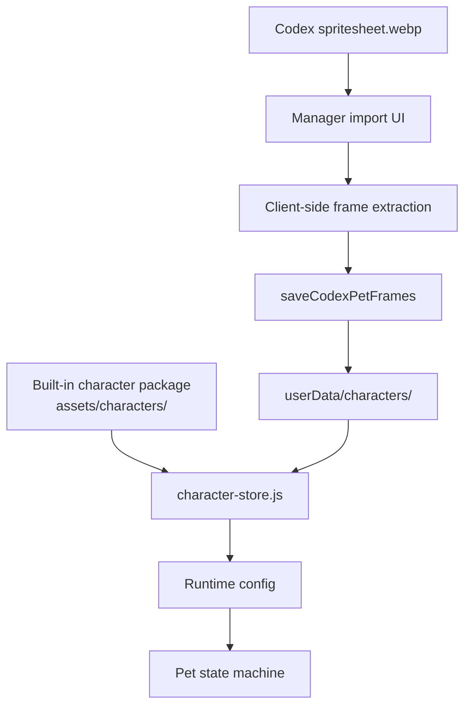

# Architecture

This app is a local-first Electron desktop pet. It has two browser windows, one preload bridge, and a small main-process backend that reads packaged assets and writes imported pets to Electron `userData`.

## Process Map



## Data Flow



## Asset Flow



## Security Boundary

- Renderer windows run with `nodeIntegration: false` and `contextIsolation: true`.
- `src/preload.js` exposes a narrow `window.desktopPet` API.
- `src/main/app-controller.js` wraps all IPC handlers with trusted sender validation: the call must come from a known app window and an allowed local page URL.
- `src/main/security.js` installs session-level CSP, denies permission prompts, blocks navigation, and prevents new windows.
- Manager rich text localization is rendered through a whitelist that only allows `<code>` tags.

## Persistence

User data lives under Electron `app.getPath("userData")`:

```text
userData/
  settings.json
  characters/
    <imported-pet-id>/
      icon.png
      manifest.json
      frames/
```

Packaged builds include `src/**/*`, selected fonts, `assets/characters/**/*`, and app/tray icons. Temporary helper files and source-only assets are excluded by `package.json` build rules and checked by `npm run check:assets`.
